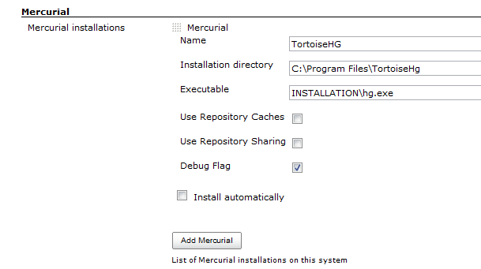

Jenkins Mercurial Plugin
=========================

[](https://plugins.jenkins.io/mercurial)
[](https://github.com/jenkinsci/mercurial-plugin/releases/latest)
[](https://plugins.jenkins.io/mercurial)


This plugin integrates the [Mercurial version control
system](https://www.mercurial-scm.org/) with Jenkins.

With this plugin, you can designate a Mercurial repository as the
"upstream" repository. Every build will then run something like
`hg pull -u` to bring the tip of this upstream repository. In a similar
manner, polling will check if the upstream repository contains any new
changes, and use that as the triggering condition of the new build.
 This plugin is currently intended to support Mercurial 1.0 and later.

Viewers are included for various hosted services.

### Push Notifications

As of version 1.38 it's possible to trigger builds using push
notifications instead of polling. In your repository's .hg/hgrc file
add:

``` ini
[hooks]
commit.jenkins = wget -q -O /dev/null <jenkins root>/mercurial/notifyCommit?url=<repository remote url>
incoming.jenkins = wget -q -O /dev/null <jenkins root>/mercurial/notifyCommit?url=<repository remote url>
```

This will scan all the jobs that's configured to check out the specified
URL, and if they are also configured with polling, it'll immediately
trigger the polling (and if that finds a change worth a build, a build
will be triggered in turn.)

This allows a script to remain the same when jobs come and go in
Jenkins. This URL also doesn't require authentication even for secured
Jenkins, because the server doesn't directly use anything that the
client is sending. It runs polling to verify that there is a change,
before it actually starts a build.

When successful, this will return the list of projects that it triggered
polling as a response.

Jobs on Jenkins need to be configured with the SCM polling option to
benefit from this behavior. This is so that you can have some jobs that
are never triggered by the post-commit hook, such as release related
tasks, by omitting the SCM polling option.

As of version 1.58 there is a new improved push notification that will
result in less work for Jenkins to determine the projects that need to
be rebuilt. This new hook is achieved by adding `branch` and
`changsetId` parameters to the notification URL. Newer versions of
Mercurial can achieve this with an in-process hook such as
that shown in test sources in [hook.py](https://github.com/jenkinsci/mercurial-plugin/tree/master/src/test/resources/hook.py)

## Windows/TortoiseHG Integration 

There are some caveats to running TortoiseHG on windows, particularly
with ssh. Here are some notes to help.

**Prerequisites:**

-   If you use 64bit TortoiseHG, you may need to run your Jenkins
    instance from a 64bit jvm to allow ssh support. If not, the initial
    clone will hang.
-   For ssh support, you will either  need putty/pageant installed to
    send the proper keys to the server if the keys are password
    protected, or you will need to specify the change in the ui section
    mercurial.ini found in C:\\Users\\username\\mercurial.ini to use a
    specific key:
        
     ``` ini
     [ui]
     ssh="C:\program files\tortoisehg\TortoisePlink.exe" -i "C:\Users\username\key_nopass.ppk"
     ```

-   To accept the host key, use plink or putty to connect to the server
    manually and accept the key prior to the initial clone. You can also
    use the tortoiseplink.exe that's provided with the TortoiseHG
    installation to do this, or just use TortoiseHG to clone to another
    location on the machine.
-   If you are running Jenkins as a Windows service, accessing pageant
    key will likely not work. In this case, use a key without passphrase
    configured in mercurial.ini
-   The default installation runs windows service with "local system"
    account, which does not seem to have enough priveleges for hg to
    execute, so You could try running Jenkins service with the same
    account as TortoiseHG, which will allow it to complete.

Example, from a command prompt: 

    "C:\program files\tortoisehg\TortoisePlink.exe" user@hg.example.com

Click 'Yes' on the host key dialog. You can then cancel the next dialog
prompting for password.

**Main Configuration, Step by Step:**

1.  Install the Jenkins Mercurial Plugin.
2.  Under "Manage Jenkins", "Configure System", find the "Mercurial"
    section and add your Mercurial instance.



3\. Save the configuration.

**Job Configuration**

1.   Select Mercurial under Source Code Management
2.   Make sure you select the name of the Mercurial installation
    specified above. In my case, "TortoiseHG"
3.   The url can either be ssh or https.

Example SSH URL:

    ssh://hg@bitbucket.org/myuser/projectname

**Other Windows+TortoiseHG+ssh notes:**

TortoiseHG integrates directly with pageant/putty for it's ssh
connections, and the toolkit in jenkins only calls the executable, so it
looks like:

Jenkins -\> Mercurial Plugin -\> TortoiseHG \> plink/pageant

Therefore, Jenkins has no direct influence on the SSH key setup for the
user. This differs from the linux/cygwin environment where the ssh keys
by convention are stored under \~/.ssh. 

## Environment Variables

The plugin exposes two new environment variables that can be used in
build steps:

-   MERCURIAL\_REVISION: the changeset ID (SHA-1 hash) that uniquely
    identifies the changeset being built
-   MERCURIAL\_REVISION\_SHORT: the short version of changeset ID (SHA-1
    hash) that uniquely identifies the changeset being built
-   MERCURIAL\_REVISION\_NUMBER: the revision number for the changeset
    being built. since this number may be different in each clone of a
    repository, it is generally better to use MERCURIAL\_REVISION.

## Auto Installation

The plugin supports generic tool auto-installation methods for your
Mercurial installation, though it does not publish a catalog of
Mercurial versions. For users of Linux machines (with Python
preinstalled), you can use ArchLinux packages. For example, in
`/configure` under Mercurial installations, add a Mercurial installation
with whatever Name you like, Executable = `INSTALLATION/bin/hg`, Install
automatically, Run Command, Label = `linux` (if desired to limit this to
agents configured with the same label), Command =
`[ -d usr ] || wget -q -O -`
`http://www.archlinux.org/packages/extra/i686/mercurial/download/`
`| xzcat | tar xvf -` (or `…/x86_64/…` for 64-bit agents), Tool Home =
`usr`, and configure a job with this installation tied to a Linux agent.

## Version History

### Versions 2.7 and later

See [GitHub
releases](https://github.com/jenkinsci/mercurial-plugin/releases).

### Earlier versions

Please refer to the [changelog](CHANGELOG.md).
